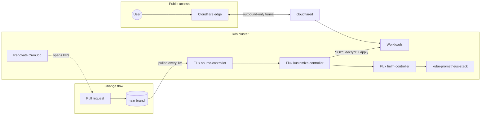

# homelab-k3s

GitOps-managed Kubernetes homelab: a [k3s](https://k3s.io) cluster fully
reconciled by [Flux CD](https://fluxcd.io) from this repository. Nothing is
ever `kubectl apply`'d by hand — a merged pull request **is** the deployment,
and a deleted file **is** the teardown.

## Design principles

- **Git is the single source of truth.** Every Flux Kustomization runs with
  `prune: true`: the cluster converges to exactly what's in `main`, including
  removals. Cluster state and its full history are one `git log` away.
- **Secrets live in git too — encrypted.** SOPS + [age](https://age-encryption.org)
  encrypt secret values in place; Flux decrypts them in-cluster. Exactly one
  secret exists outside git: the age private key.
- **Zero open inbound ports.** Public apps are exposed through Cloudflare
  Tunnels — outbound-only connections from the cluster to Cloudflare's edge.
  The home network accepts no inbound traffic.
- **Least privilege by default.** All workloads run as non-root with explicit
  UIDs; my own app runs from a distroless image with a read-only root
  filesystem.
- **Updates are automated, but gated.** A self-hosted Renovate opens PRs for
  dependency updates; a human merges; Flux deploys. Even bots go through the
  GitOps front door.

## Stack

| Layer | Tool |
|---|---|
| Kubernetes | k3s (single node) |
| GitOps engine | Flux CD (kustomize- + helm-controller) |
| Manifest composition | Kustomize (base / overlay) |
| Secrets | SOPS + age, decrypted in-cluster by Flux |
| Monitoring | kube-prometheus-stack (Prometheus, Grafana, Alertmanager) via HelmRelease |
| Dependency updates | Renovate (self-hosted CronJob) |
| Public ingress | Cloudflare Tunnels (per-app) |
| Internal ingress | Traefik (k3s built-in) |

## Architecture



## Repository layout

```
clusters/staging/          # Flux entry point: one Kustomization per layer
├── flux-system/           # Flux bootstrap manifests
├── apps.yaml              # → apps/staging        (SOPS decryption enabled)
├── infrastructure.yaml    # → infrastructure/controllers/staging
└── monitoring.yaml        # → monitoring/{controllers,configs}/staging

apps/
├── base/<app>/            # Environment-agnostic: Deployment, Service, PVCs
└── staging/<app>/         # Environment-specific: namespace, tunnel, secrets

infrastructure/controllers/  # Cluster tooling (Renovate)
monitoring/
├── controllers/           # HelmRepository + HelmRelease
└── configs/               # Configuration consumed by the release (secrets)
```

The **base/overlay** split keeps app manifests environment-agnostic; adding a
production environment means adding overlays, not duplicating bases. The
**controllers/configs** split lets the Helm release and its configuration
reconcile independently.

## How a change reaches the cluster

1. A PR merges to `main`.
2. Flux's **source-controller** pulls the new commit (1-minute interval).
3. The **kustomize-controller** rebuilds each layer: decrypts SOPS secrets
   with the in-cluster age key, renders the overlay, and server-side-applies
   the result. Pruning removes anything deleted from git.
4. For monitoring, the **helm-controller** upgrades the HelmRelease. Drift
   detection reverts out-of-band changes to Helm-managed resources.

## Secrets

Encrypted with SOPS using an age recipient; [`.sops.yaml`](.sops.yaml) scopes
encryption to `data`/`stringData`, so secret *metadata* stays readable in
diffs and PR review while *values* are ciphertext.

Flux decrypts at apply time using the age private key stored in the
`sops-age` secret in `flux-system` — created once at bootstrap and backed up
offline. It is the trust root and the only secret that never touches git.

## Applications

| App | What it is | Exposure |
|---|---|---|
| [fogos](apps/base/fogos/) | My own service (self-contained static binary on a distroless image) serving Portuguese wildfire incident data | Cloudflare Tunnel |
| [linkding](apps/base/linkding/) | Self-hosted bookmark manager | Cloudflare Tunnel |
| [audiobookshelf](apps/base/audiobookshelf/) | Audiobook & podcast server | Cloudflare Tunnel |
| Grafana | Dashboards for the monitoring stack | LAN-only, via Traefik ingress + TLS |

Each public app gets its **own** tunnel with its own credentials: a leaked
credential exposes one service, not the whole lab. Grafana is deliberately
not tunneled — the monitoring stack's admin UI has no business on the public
internet.

## Bootstrap / disaster recovery

The cluster is disposable; the repo is not. Full rebuild:

```sh
# 1. Install k3s
curl -sfL https://get.k3s.io | sh -

# 2. Bootstrap Flux against this repository
flux bootstrap github \
  --owner=rodolfonuneslopes --repository=homelab-k3s \
  --branch=main --path=clusters/staging --personal

# 3. Restore the age key (the one manual secret)
kubectl create secret generic sops-age \
  --namespace=flux-system \
  --from-file=age.agekey=/path/to/backup/age.agekey
```

Flux reconciles everything else — namespaces, apps, tunnels, monitoring — in
minutes.
